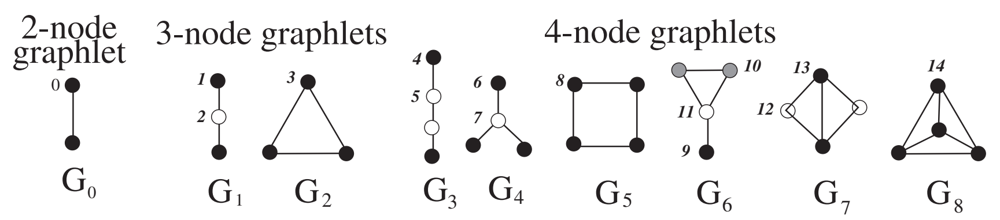
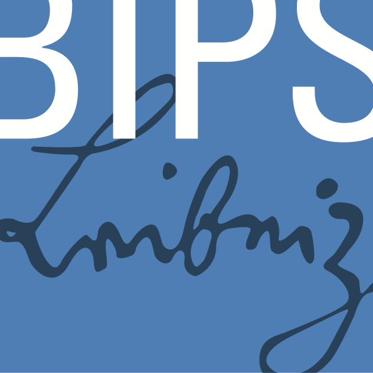

```{r setup, include=FALSE}
# This chunk is not visible in the presentation
# Use it to set up misc. options for your code/output

# knitr chunk options for all chunks
knitr::opts_chunk$set(
  echo = TRUE,          # Set FALSE to hide R code
  warning = FALSE,      # Don't show warnings from R code
  dev = "ragg_png",     # Higher quality png graphics device
  fig.align = "center", # Centered plots (recommended)
  fig.retina = 2        # Higher image quality for high resolution screens
)

# xaringanExtra features, see https://pkg.garrickadenbuie.com/xaringanExtra/
xaringanExtra::use_xaringan_extra(
  c("tile_view", "panelset", "clipboard", "fit_screen")
)

library(dplyr)
library(forcats)
library(purrr)
library(ggplot2)
library(igraph)
```


## Motivation: Gene Network Recovery


.pull-left[

+ Cancer affects p53 pathway 

+ Toy example: 
    - Gene expression from The Cancer Genome Atlas Program (TCGA)
    
    - Head and neck squamous cell carcinoma 
    
    - Cell cycle proteins are altered in differently in HPV-positive and HPV-negative cancer
    
    - 74 genes, 74 observations 

]

.pull-right[
```{r tcgamotiviation, echo = FALSE}
load(file = "data/tcgaexample.rda")

g <- make_empty_graph(n = 74)
V(g)$label <- namen
V(g)$label.cex <- 0.75

v_label_colors <- rep("black", length(namen))
v_label_colors[which(namen %in% c("TP53", "TP53AIP1"))] <- "#31D139"

set.seed(3)
layout <- layout_nicely(g)
plot(g, layout  = layout, vertex.size = 0, vertex.label.color = v_label_colors)
```
]


???

Genetic example data to motiviate the simulation study

The gene TP53 encodes the p53 tumour suppressor protein which initiates cell cycle arrest and apoptosis in response to DNA damage. 


---
# Graphical Models 

.pull-left60[

+ A **graph** $G = (V, E)$ consists of vertices $V = \{1, \ldots, p\}$ and edges $E \subseteq V \times V$ 

+ Undirected edges: $e_{st} = e_{ts}$

+ The .bipsblue[**sparsity**] (density) is defined as 

$$
  s(G) = \frac{|E|}{ {p \choose 2} / 2}
$$

]

.pull-left40[
```{r hugeplot, echo = FALSE}
library(huge)

# Random
set.seed(3687)
er <- huge::huge.generator(graph = "random", vis = FALSE, verbose = FALSE)
huge::huge.plot(er$theta)
```

]


???

Gm is a probabilistic model that uses a graph to express the conditional dependence structure between random variables

---
class: center

#Gaussian Graphical Models (GGM)

\begin{equation*}
	X = (X_1, X_2, \ldots, X_p)^T \sim \mathcal{N}_p\left( \mu, \Sigma \right)
\end{equation*}


\begin{equation*}
	\underbrace{\Theta}_{\text{precision matrix}} = \underbrace{\Sigma^{-1}}_{\text{inverse covariance matrix}} 
\end{equation*}


$X_s \perp \!\!\! \perp X_t \mid \text{all other variables} \quad\rightarrow\quad \theta_{st} = 0$


.bipsblue[**Precision matrix**] $\quad\rightarrow\quad$ Adjacency matrix


???

- p-dimensional random vector following a multivariate normal distribution 
- The inverse Θ = Σ−1 of the covariance is called the precision or concentration matrix.
- In the case of gaussianity, Θ contains information on the pairwise conditional dependencies between variables
- adjecency matrix expresses graph structure

---
# Estimating High-Dimensional GGMs


\begin{equation*}
	\widehat{\Theta} =
	\underset{\Theta \succ 0}{\operatorname{arg min}}  
	\underbrace{\operatorname{tr}(\widehat{\Sigma}\Theta) - 
	\operatorname{log det} 
  \left( \Theta \right)}_{\ell(\Theta)} 
\end{equation*}


???

Low-dimension: Maximum-Likelihood

---

# Estimating High-Dimensional GGMs

\begin{equation*}
	\widehat{\Theta} =
	\underset{\Theta \succ 0}{\operatorname{arg min}}  
	\underbrace{\operatorname{tr}(\widehat{\Sigma}\Theta) - 
	\operatorname{log det} 
  \left( \Theta \right)}_{\ell(\Theta)} \quad + \quad \lambda 
  \left\lVert \Theta \right\rVert_1
\end{equation*}

--

+ .bipsblue[**Graphical lasso (glasso)**] is an efficient and widely used algorithm to solve the computationally expansive problem 


--

+ Let $\Lambda = \{\lambda_1, \ldots, \lambda_K\}$ be the .bipsblue[**regularization path**] with positive $\lambda$

--

+ $s(\hat{G}(\lambda))$ depends highly on $\lambda$

???

- high-dim case requires regularization
- best tuning parameter -> requires selection method

--

+ .bipsorange[**Challenge:**] suitable choice of the .bipsblue[tuning parameters]

   - .bipsblue[AIC / BIC] select overly dense graphs in high dimensions $(p > n)$
   
   - Stability to Regularization Approach (.bipsblue[**StARS**])

???

- AIC / BIC work well in low dimensional settings (p < n, fixed p with increasing n, but select overly dense graphs in high dimensions

- simulation study on performance of StARS and some of its versions.


---

# .font80[Stability Approach for Regularization Selection (StARS)]

.bipsblue[**Idea of StARS:**] .cite[(Liu et al., 2010)]

1. Draw $N$ random .bipsblue[**subsamples**] $S_1, \ldots, S_N$ from $X_1, \ldots, X_n$, each of size $b < n$ 


???

We draw many random subsamples and construct a graph from each subsample (unlike K-fold cross-validation, these subsamples are overlapping). 


---

# .font80[Stability Approach for Regularization Selection (StARS)]

.bipsblue[**Idea of StARS:**] .cite[(Liu et al., 2010)]

1. Draw $N$ random .bipsblue[**subsamples**] $S_1, \ldots, S_N$ from $X_1, \ldots, X_n$, each of size $b < n$ 

2. For each $\lambda \in \Lambda$ and  for each subsample $j$ estimate $\hat{G^j}(\lambda) = (V, \hat{E^j}(\lambda))$ 
   

???

We draw many random subsamples and construct a graph from each subsample (unlike K-fold cross-validation, these subsamples are overlapping). 


---

# .font80[Stability Approach for Regularization Selection (StARS)]

.bipsblue[**Idea of StARS:**] .cite[(Liu et al., 2010)]

1. Draw $N$ random .bipsblue[**subsamples**] $S_1, \ldots, S_N$ from $X_1, \ldots, X_n$, each of size $b < n$

2. For each $\lambda \in \Lambda$ and  for each subsample $j$ estimate $\hat{G^j}(\lambda) = (V, \hat{E^j}(\lambda))$ 

3. .bipsblue[**Total instability:**] average over the **instability** (variability) of all edges $(s,t)$   
\begin{equation*}
  \hat{D}_N(\lambda) = \sum_{s < t} 4 \cdot \hat{\theta}_{st}(\lambda)(1 - \hat{\theta}_{st}(\lambda)) / {p \choose 2}
\end{equation*}
   with $\hat{\theta}_{st}^N(\lambda) = \frac{1}{N}\sum_{j = 1}^N \hat{e}^j(\lambda)_{st}$. 
   

???

We want to choose the regularization parameter so that the obtained graph is sparse and there is not too much variability across subsamples.

---

# StARS

.pull-left65[
```{r totalinstability, echo = FALSE, fig.width = 10, warning = FALSE}
load("data/totalinstability.rda")

plot_ti <- ggplot2::ggplot(data = filter(daten, what == 'Total instability'), 
                aes(x = lams, y = stability, group = what)) + 
           geom_line(size = 0.75) + 
           geom_point(color="#424242", fill="white", size = 2, shape = 21) + 
           geom_line(aes(color = what), size = 1) + 
           scale_color_manual(values = c("#F98437", "#1763AA")) +
           labs(x = "Regularization path", y = "Total instability", color = "") +
           theme_bw(base_size = 20, base_family = "Roboto Condensed") + 
           theme(legend.position = 'top', legend.direction = "horizontal")

plot_ti
```
]

.pull-right35[


]

???

total instability function is not optimal to find one unique best lambda

---

# StARS

.pull-left65[
```{r totalinstability2, echo = FALSE, fig.width = 10, warning = FALSE}
# load("data/totalinstability.rda")

plot_ti <-
ggplot2::ggplot(data = daten, aes(x = lams, y = stability, group = what)) +
  geom_line(size = 0.75) +
  geom_point(color="#424242", fill="white", size = 2, shape = 21) +
  geom_line(aes(color = what), size = 1) +
  scale_color_manual(values = c("#F98437", "#1763AA")) +
  labs(x = "Regularization path", y = "Total instability", color = "") +
  theme_bw(base_size = 20, base_family = "Roboto Condensed") +
  theme(legend.position = 'top', legend.direction = "horizontal")


plot_ti


```
]

.pull-right35[

+ Use $\bar{D}_N(\lambda) = \operatorname{sup}_{\tilde{\lambda} \in \Lambda: \tilde{\lambda} \geq \lambda} \hat{D}_N(\lambda)  \rightarrow$ monotonically increasing

]


---

# StARS

.pull-left65[
```{r totalinstability3, echo = FALSE, fig.width = 10, warning = FALSE}
# load("data/totalinstability.rda")

plot_ti  + 
  geom_hline(yintercept = 0.1, color="red", size = .5) +
  geom_point(aes(x = lams[opt.index], y = cummax(stability)[opt.index]), shape = 21, color="black", fill="#31D139", size = 3.5) +
  annotate(geom = "text", x = 0.29, y = 0.13, label = expression(paste(lambda, " selected by StARS")), size = 8) 

```
]

.pull-right35[

+ Use $\bar{D}_N(\lambda) = \operatorname{sup}_{\tilde{\lambda} \in \Lambda: \tilde{\lambda} \geq \lambda} \hat{D}_N(\lambda)  \rightarrow$ monotonically increasing

+ StARS selects $\lambda_{\beta} = \operatorname{inf}\{\lambda \in \Lambda: \bar{D}_N(\lambda) \leq \beta\}$ with standard $\beta = 0.1$

]

???

Beta determines how much variability in the graph structure I want to allow under random subsampling

---

# Generalized StARS (G-StARS)

.bipsblue[**Idea of G-StARS:**] .cite[(Müller et al., 2016)]

+ Generlizes the concept of .strong[edge instability] to instability of .strong[small subgraphs] (.bipsblue[**graphlets**])

--

+ Graphlets of 2-4 nodes contain 11 unique .bipsblue[**orbits**]


.center[



.font80[Figure from .cite[Pržulj (2007)]]]


???

- different orbits can belong to the same graphlet
- a node can belong to different graphlets and to different orbits


---

# G-StARS

+ Count number of unique 11 orbits for each node (up to 4-node graphlets) $\rightarrow$ 
.bipsblue[graphlet degree matrix] $\text{GDM} \in \mathbb{N}^{p \times 11}_0$

--

+ Use vectorized upper triangle of the .bipsblue[graphlet correlation vector] $\text{GCV}(G) = \operatorname{vec}(\operatorname{cor}_S(\text{GDM}(G)))$ to describe topology signatures 


???

Spearman rank correlation

The GCD is able to efficiently discriminate between different graph structures

this is very helpful, because in the next step we want to assess global topological variability


---

# G-StARS

+ Count number of unique 11 orbits for each node (up to 4-node graphlets) $\rightarrow$ 
.bipsblue[graphlet degree matrix] $\text{GDM} \in \mathbb{N}^{p \times 11}_0$


+ Use vectorized upper triangle of the .bipsblue[graphlet correlation vector] $\text{GCV}(G) = \operatorname{vec}(\operatorname{cor}_S(\text{GDM}(G)))$ to describe topology signatures 


+ Assess global topological variability between two estimated graphs at fixed $λ$ with the .bipsblue[graphlet correlation distance]:

$$ \text{GCD}(G_1, G_2) = \left\lVert \text{GCV}(G_1) - \text{GCV}(G_2) \right\rVert_2$$
--

+ Used by .bipsorange[Müller et al.] to define .bipsblue[**total graphlet instability**]

$$\hat{d}_N(\lambda) = \sum_{s < t} \text{GCD}(\hat{G^s}(\lambda), \hat{G^t}(\lambda)) / {N \choose 2}$$


???

The GCD is able to efficiently discriminate between different graph structures

TGI over N graph estimates is the average Euclidean distance among all graphlet correlation vectors.

The TGI consideres the variability of the graphlet correlation vector of the graph instead of the variability of edges


---
# G-StARS


.pull-left65[
```{r tgi, echo = FALSE, fig.width = 10, warning = FALSE}
load("data/tGi.rda")

ggplot(daten, aes(x = lams, y = tgi)) +
       geom_line(size = 1.75, color="#F98437") + 
       geom_point(color="#424242", fill="white", size = 2, shape = 21) +
       labs(x = "Regularization path", y = "Total graphlet instability", color = "") +
  theme_bw(base_size = 20, base_family = "Roboto Condensed") +
  theme(legend.position = 'top', legend.direction = "horizontal")

```

]

.pull-right35[


+ $\hat{d}_N(\lambda)$ will likely be non-monotonic and potentially multi-modal over $\Lambda$

+ .bipsorange[Müller et al.] proposed to use $\hat{d}_N(\lambda)$ for local optimization

]


???

TGI is not monoton and can have multiple local minima

Because of topology of the underlying true graph

- reduced regularization path and look there for the local minima

---

# G-StARS

.bipsblue[**G-StARS:**] 

+ Use .bipsblue[**Bounded StARS**] to estimate .bipsblue[lower bound] and .bipsblue[upper bound] $\lambda_{lb}, \lambda_{ub} \in \Lambda$ of $\lambda_{\beta}$ with $N = 2$ subsamples to determine $\Lambda(\beta) = \{\lambda \in \Lambda: \lambda_{lb} \leq \lambda \leq \lambda_{ub}\}$ 

+ Select $\lambda_{\beta}^G = \operatorname{arg min}_{\lambda \in \Lambda(\beta)} \hat{d}_N(\lambda)$
    
    
$\rightarrow$ Desired edge stability is approximately met while being locally
maximally stable w.r.t. graphlet variability .cite[(Müller et al., 2016)]


???

lambda_beta = Stars estimator

B-StARS: Faster version of StARS algorithm because it limits the search space of the regularization path

Ensures that desired edge stability is approximately satisfied while being locally maximally stable with respect to graphlet variability

---
# Comparator Method

+ Compare StARS & Co. to an algorithm that is 

    + Behaves similar to StARS
    
    + Only based on sparsity 
    

--

+ .bipsblue[Sparsity based Regularization Selection (**SpARS**)] is 

    + Based on a function that is comparable to $\hat{D}_N(\lambda)$ 
    
    + Deterministic in sparsity $s$
    
    + **Not** meant as a competitive or efficient selection algorithm!
    

???

- requirements were
- selection only based on sparsity independent of data

- SpARS does not account for edge variability in subsamples. 
- Because of time limitation, I cant go into details 
    
- Here $(\beta = 0.1, N=20)$: SpARS selects graphs with $\hat{s} \sim 0.027$


---
# Simulation Study

.pull-left65[.font80[

  + Graph type
     + Erdös-Rényi $(s \in \{ \tfrac{3}{4p}, \tfrac{3}{p}, \tfrac{12}{p} \})$
     + Scale-free $(s = \tfrac{1}{2p})$
     + Hub (equal and unequal hub sizes) $s = \tfrac{p - \text{# hubs}}{p \choose 2}$
     
  
  + Three dimensions 
  
     + $p = 100, n = 400$
     + $p = 200, n = 200$
     + $p = 400, n = 100$
  
  + 100 repetitions
  
  + $N=$ 20 subsamples, $\beta = 0.1$

  + R-packages: `huge, pulsar`
  
]]


.pull-right35[
```{r hugeplot2, echo = FALSE, fig.height=9}
library(huge)

# Random
set.seed(3687)
er <- huge::huge.generator(graph = "random", v = .5, u = .1, vis = FALSE, verbose = FALSE)
sf <- huge::huge.generator(graph = "scale-free", v = .5, u = .1, vis = FALSE, verbose = FALSE)
hub <- huge::huge.generator(graph = "hub", g = 5, v = .5, u = .1, vis = FALSE, verbose = FALSE)

g1 <-  igraph::graph.adjacency(as.matrix(er$theta != 0), mode = "undirected", diag = FALSE)
g2 <-  igraph::graph.adjacency(as.matrix(sf$theta != 0), mode = "undirected", diag = FALSE)
g3 <-  igraph::graph.adjacency(as.matrix(hub$theta != 0), mode = "undirected", diag = FALSE)

op <- par(mfrow = c(3,1), mar = c(2,1,1,1))
 plot(g1, edge.color = "#424242", vertex.color = "#F98437", vertex.size = 4, vertex.label = NA) #, layout = layout.grid, )
 plot(g2, edge.color = "#424242", vertex.color = "#F98437", vertex.size = 4, vertex.label = NA)
 plot(g3, edge.color = "#424242", vertex.color = "#F98437", vertex.size = 4, vertex.label = NA)
par(op)

```

]


---
# Performance Measures

.pull-left65[

Difference between $G$ and $\hat{G}(\lambda_{\beta})$ measured by

+ Precision $P = \frac{\text{# true selected edges}}{\text{# selected edges}}$

+ Recall $R = \frac{\text{# true selected edges}}{\text{# true edges}}$

+ F1-Score $F1 = 2 \cdot \frac{P \cdot R}{P + R}$

+ F2-Score $F2 = 5 \cdot \frac{P \cdot R}{4 \cdot P + R}$

+ Oracle-F2 $oF2$: best possible F2-score over $\Lambda$

]

.pull-right35[

```{r prerecplot, echo = FALSE, fig.height = 4.5}
load(file = "data/precrec.rda")

op <- par(mfrow = c(3,1), mar = c(1,1,2,1))
 plot_precrec + theme(legend.text=element_text(size=20))
 plot_F12 + theme(legend.text=element_text(size=20))
par(op)

```


]

???

- F2-score values recall twice as high as precision
- useful because in many applications the proportion of selected edges given the truth is considered more important 


---
exclude: true

# Low dimensional (p = 100, n = 400)

```{r lowdimF1, echo = FALSE, fig.width = 16, warning = FALSE, eval = FALSE}
daten <- readRDS("data/low-dimensional.rds")

# F1 plot
daten  %>% filter(!(method %in% c("oF2", "OS"))) %>%
  ggplot( aes(x = graph, y = F1, fill = method)) + 
  geom_boxplot() +
  coord_cartesian(ylim = c(0, 1)) +
  labs(x="", y = "F1 score") +
  theme_bw(base_size = 20, base_family = "Roboto Condensed") + 
  theme(legend.position = 'top', legend.direction = "horizontal") + 
  labs(fill = "")

```


---
# Low dimensional (p = 100, n = 400)

```{r lowdimF2, echo = FALSE, fig.width = 16, warning = FALSE}
daten <- readRDS("data/low-dimensional.rds")

# F2 plot
daten  %>% filter(!(method %in% c("oF1", "OS"))) %>%
  ggplot( aes(x = graph, y = F2, fill = method)) + 
  geom_boxplot() +
  coord_cartesian(ylim = c(0, 1)) +
  labs(x="", y = "F2 score") +
  theme_bw(base_size = 20, base_family = "Roboto Condensed") + 
  theme(legend.position = 'top', legend.direction = "horizontal") + 
  labs(fill = "")

```

???

- Performance is different for different graph types

- StARS and B-StARS are very similar

- G-Stars performance is only better for the dense random graph

- Spars is performing equally good except for dense random graphs and the hub graphs

- Hub graphs with unequal hub sizes are doing not so good.

- oracle F2 score is usually better than StARS -> there would be a better lambda in the regularization path


---
exclude: true
# 'p = n'-dimension (p = 200, n = 200)

```{r middimF1, echo = FALSE, fig.width = 16, warning = FALSE, eval = FALSE}
daten <- readRDS("data/mid-dimensional.rds")

# F1 plot
daten  %>% filter(!(method %in% c("oF2", "OS"))) %>%
  ggplot( aes(x = graph, y = F1, fill = method)) + 
  geom_boxplot() +
  coord_cartesian(ylim = c(0, 1)) +
  labs(x="", y = "F1 score") +
  theme_bw(base_size = 20, base_family = "Roboto Condensed") + 
  theme(legend.position = 'top', legend.direction = "horizontal") + 
  labs(fill = "")

```


---
# 'p = n'-dimension (p = 200, n = 200)

```{r middimF2, echo = FALSE, fig.width = 16, warning = FALSE}
daten <- readRDS("data/mid-dimensional.rds")

# F2 plot
daten  %>% filter(!(method %in% c("oF1", "OS"))) %>%
  ggplot( aes(x = graph, y = F2, fill = method)) + 
  geom_boxplot() +
  coord_cartesian(ylim = c(0, 1)) +
  labs(x="", y = "F2 score") +
  theme_bw(base_size = 20, base_family = "Roboto Condensed") + 
  theme(legend.position = 'top', legend.direction = "horizontal") + 
  labs(fill = "")

```


???

- the performance is getting much worse, and the performance variablity is increasing

- according to oracle: for random graphs, much better estimations would be possible (see oracle)

- B-Stars selects a bit denser graphs than StARS: 

- Spars is often closer to oracle than Stars


---
exclude: true
# High dimensional (p = 400, n = 100)

```{r highdimF1, echo = FALSE, fig.width = 16, warning = FALSE, eval = FALSE}
daten <- readRDS("data/high-dimensional.rds")

# F1 plot
daten  %>% filter(!(method %in% c("oF2", "OS"))) %>%
  ggplot( aes(x = graph, y = F1, fill = method)) + 
  geom_boxplot() +
  coord_cartesian(ylim = c(0, 1)) +
  labs(x="", y = "F1 score") +
  theme_bw(base_size = 20, base_family = "Roboto Condensed") + 
  theme(legend.position = 'top', legend.direction = "horizontal") + 
  labs(fill = "")

```


---
# High dimensional (p = 400, n = 100)

```{r high0dimF2, echo = FALSE, fig.width = 16, warning = FALSE}
daten <- readRDS("data/high-dimensional.rds")
# F2 plot
daten  %>% filter(!(method %in% c("oF1", "OS"))) %>%
  ggplot( aes(x = graph, y = F2, fill = method)) + 
  geom_boxplot() +
  coord_cartesian(ylim = c(0, 1)) +
  labs(x="", y = "F2 score") +
  theme_bw(base_size = 20, base_family = "Roboto Condensed") + 
  theme(legend.position = 'top', legend.direction = "horizontal") + 
  labs(fill = "")

```

???

- lambda selection in scale-free and hub graphs with unequal hub sizes fail

- for random graphs, much better estimations would be possible (see oracle)

- the denser a graph is, the worse is Oracle

- Overall, performance variability decreased a lot


---
# TCGA p53-pathway

```{r tcgaplot, echo = FALSE, fig.width = 16}
# load("data/tcgaexample.rda")

vertex_label_colors[which(namen %in% c("CCNB1", "CCNB2", "CDK1"))] <- "#31D139"
V(g.new)$label.cex <- 0.75
V(g.new2)$label.cex <- 0.75

op <- par(mfrow = c(1,2), mar = c(1,1,1,1))
plot(g.new, layout  = layout, edge.color = E(g.new)$color, edge.width = 2.5,
     vertex.label = namen, vertex.size = 0, vertex.label.color = vertex_label_colors,
     main = expression(paste("StARS = B-StARS, ", lambda," = 0.628")))
plot(g.new2, layout  = layout, edge.color = E(g.new2)$color, edge.width = 2.5, 
     vertex.label = namen, vertex.size = 0, vertex.label.color = vertex_label_colors,
     main = expression(paste("G-StARS, ", lambda," = 0.645")))
par(op)


```

???

- no edge connected to p53 gene (is hard to measure)

- most connectivity have CCBN1, CCBN1, CDK1: all genes which induces cell cycle arrest to repair DNA damages


---
# Conclusion (based on glasso)

+ StARS, B-StARS selection depends heavily on sparsity

--

+ Choice of $\beta$ influences the output graph: lower values better for sparse graphs (scale-free, hub)

--

+ G-StARS does not seem to select better graphs (F2-Score)

--

+ Regularization with single tuning parameter might have problems identifying hub structures of varying sizes and scale-free graphs


---
# Discussion  and Outlook

+ .font90[Simultation study is limited] .cite[(e.g., Laszkiewicz et al. (2021), Abbruzzo et al. (2019), Wysocki & Rhemutulla (2021))]

--

+ .font90[Estimation of glasso function (`huge` R package) is very poor in ~ 5 %:

   + Possibly related to "warm starts" of the algorithm .cite[(Mazumder & Hastie, 2012)] 
   
   + Worse with StARS (failures in subsamples)]

--

+ .font90[G-StARS is promising, but does not utilize full potential of graphlet correlation vector]

--

+ .font90[Need for novel tuning parameter selection methods for high-dimensional graphs:
  
  + Independent of sparsity **AND** 
  
  + Graph estimation methods with > 1 tuning parameter]


???

- Bias of warm starts cummulates in subsampels: B-Stars has an advantage here

- No failure in subsample: 36 %

- G-Stars: total graph instability estimated the true graphlet instability well, but it is hard to find a good information that consistently increases the qualitz of the graph

- Educated guesses on the graph type and use this information to compare graphlets of known structure to the estimated graphlets.

---
class: center, middle, thanks
background-image: none

# Thank you for your attention

### [www.leibniz-bips.de/en](https://www.leibniz-bips.de/en)

.pull-left[.right[
#### Contact  
.bipsblue[`r rmarkdown::metadata$contactauthor`]  
Leibniz Institute for Prevention Research and Epidemiology - BIPS GmbH  
Achterstraße 30  
D-28359  
.bipsblue[`r rmarkdown::metadata$contactemail`]
]]
.pull-right[

```{r, echo = FALSE, out.width = "50%"}

```
]


---
class: left
background-image: none

# References

.font70[
+ **Liu, Roeder, Wasserman (2010) Stability approach to regularization selection (StARS) for high dimensional graphical models, _Advances in Neural Information Processing Systems_ 24:1432–1440**

+ **Müller, Bonneau, Kurtz (2016) Generalized stability approach for regularized graphical models, arXiv:1605.07072**


+ Abbruzzo Vujačić, Mineo, Wit (2019) Selecting the tuning parameter in penalized Gaussian graphical models. _Statistics and Computing_ **29**:559-569

+ Banerjee, El Ghaoui, d’Aspremont (2008) Model selection through sparse maximum likelihood estimation for multivariate Gaussian or binary data, _JMLR_ **9**:485–516

+ Friedman, Hastie, Tibshirani (2008) Sparse inverse covariance estimation with the graphical lasso, _Biostatistics_ **9** :432–441

+ Laszkiewicz, Fischer, Lederer (2021) Thresholded adaptive validation: Tuning the graphical lasso for graph recovery. _International Conference on Artificial Intelligence and Statistics_ PMLR:1864-1872

+ Pržulj (2007) Biological network comparison using graphlet degree distribution, _Bioinformatics_ **23**:e177–e183

+ Wysocki, Rhemtulla (2021) On penalty parameter selection for estimating network models, _Multivariate Behavioral Research_ **56**:288-302
]